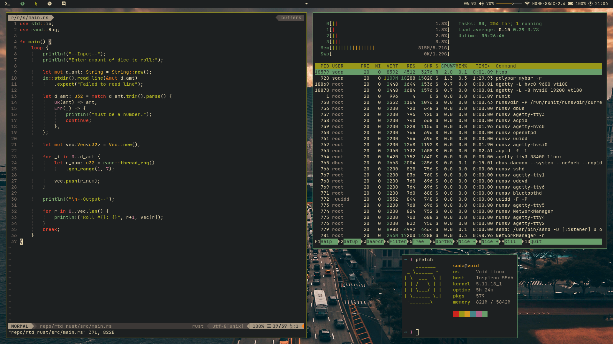

# dotfiles

### Overview
These are my dotfiles for Unix-Like OS'es

### Rice Image

### Included Dots
* bspwm
* sxhkd
* polybar
* zsh
* vim
* alacritty
* mpd

### A compositor like picom is recommended!

### Installation
* Clone this repository
* Install software for desired dots
* Install Recommended Fonts & Vim-Plug
* Move the dots to their directories
    * Move .vimrc & .zshrc to $HOME
    * All folders go in $HOME/.config/
* Done!
